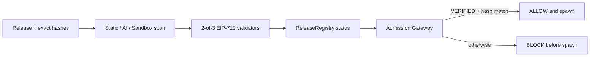

# MCPShield

MCPShield는 MCP 서버의 이름이나 서명만 신뢰하지 않고, **정확한 배포 바이트와 도구 표면, 정적·AI·샌드박스 증거, 2-of-3 검증자 판정**을 묶어 실행 직전에 `ALLOW` 또는 `BLOCK`을 강제하는 Release Firewall 프로토타입입니다.

> Registry는 무엇을 설치할 수 있는지 보여줍니다. MCPShield는 무엇을 실행해도 되는지 증명하고 강제합니다.

## 90초 데모 흐름



- `mail-mcp@1.0.0`: 정상 fixture → `VERIFIED` → Gateway가 실행합니다.
- `mail-mcp@1.0.1`: 서명된 악성 업데이트 fixture → 목적 범위 변경과 dummy canary 유출 감지 → `REVOKED` → 두 Gateway가 spawn 전에 차단합니다.
- 실제 고객 정보, 외부 수집 서버, 운영 키는 사용하지 않습니다.

## 빠른 실행

요구사항은 Node.js 22 이상 25 미만입니다. Windows PowerShell에서 실행 정책으로 `npm`이 차단되면 `npm.cmd`를 사용하세요.

```powershell
npm.cmd ci
npm.cmd run build
npm.cmd test
npm.cmd run benchmark:security
```

외부 서비스가 필요 없는 고정 재현 데모:

```powershell
npm.cmd run demo:smoke
```

임시 Backend를 실제로 띄우고 등록, 스캔 저장, 서명된 2-of-3 판정, Gateway 실행·차단을 검증하는 데모:

```powershell
npm.cmd run demo:live-smoke
```

Docker가 설치된 환경의 전체 UI 스택:

```powershell
npm.cmd run stack:up
# http://localhost:3000
npm.cmd run stack:down
```

기본 Compose 스택은 로컬 EVM에 `ReleaseRegistry`를 배포한 뒤 배포 주소를 Backend와 indexer에 공유합니다. Backend health는 `EVM` 원장 모드를 확인하며, indexer가 시작 동기화를 완료한 뒤에만 데모 seed와 UI가 시작됩니다.

## 구성

| 영역 | 위치 | 구현 내용 |
|---|---|---|
| Security·AI | `services/scanner`, `demo/fixtures`, `benchmarks` | 정적 규칙, 구조화 AI 분석, 로컬 sandbox observer, dummy canary sink, 결과 스키마, 성능 평가 |
| Blockchain·Backend | `apps/api`, `apps/validator`, `apps/indexer`, `apps/reconciler`, `contracts` | Fastify API, SQLite projection, PostgreSQL migration, EIP-712 2-of-3 컨트랙트, 이벤트 수집과 복구 |
| Frontend·Gateway·DevOps | `apps/dashboard`, `apps/gateway`, `scripts/demo`, `docker-compose.yml` | LIVE/REPLAY 대시보드, stdio Gateway, spawn 전 차단, Compose, CI, 재현 데모 |
| Shared protocol | `packages/protocol`, `packages/contracts-sdk` | 고정 JSON Schema, TypeScript 계약, 컨트랙트 SDK |

## 신뢰 경계

- 릴리스는 이름이 아니라 `releaseId + artifactDigest + toolSurfaceHash`로 식별합니다.
- AI 출력은 단독으로 차단 권한을 갖지 않습니다. 고정 JSON Schema로 제한하고 결정적 규칙·sandbox 증거와 함께 사용합니다.
- 검증자 키는 API와 분리합니다. API와 컨트랙트가 EIP-712 서명, signer, nonce, deadline, 중복 투표를 각각 확인합니다.
- `VERIFIED`이 아니거나 두 해시 중 하나라도 다르거나 상태 조회가 실패하면 Gateway는 fail closed 합니다.
- raw evidence와 비밀은 체인에 기록하지 않고 evidence hash와 상태만 기록합니다.

## 검증된 결과

2026-09-04 로컬 통합 실행 기준:

- Backend/Contract 18개, Security 25개, Gateway 20개 테스트 통과
- clean-reset Replay smoke 10/10, 비-Docker LIVE E2E, indexer-first EVM E2E 통과
- Security benchmark 10쌍: TP 10, TN 10, FP 0, FN 0, recall/precision/canary detection 1.0
- Backend TypeScript와 Dashboard Next.js production build 통과
- 전체 tracked-file 비밀 스캔 통과, `npm audit --omit=dev` 운영 의존성 취약점 0건

이 수치는 정상·악성 fixture 각 1종을 반복한 해커톤용 소규모 측정이며 일반화된 탐지 성능 주장이 아닙니다. 상세 조건은 [평가 문서](docs/evaluation.md)를 참고하세요.

## 운영 전 제한

- Docker sandbox는 Docker가 있는 Linux 호스트에서 추가 검증해야 합니다. 로컬 preload observer는 커널 수준 격리 장치가 아닙니다.
- Base Sepolia 주소와 explorer 링크는 배포 키·RPC를 제공한 뒤 생성해야 합니다.
- SQLite는 데모 런타임입니다. PostgreSQL migration은 제공하지만 production adapter는 범위 밖입니다.
- 본 프로토타입은 local stdio MCP를 우선 지원하며 모든 remote MCP를 완전 증명하지 않습니다.

자세한 내용: [구현 매트릭스](docs/implementation-matrix.md) · [아키텍처](docs/architecture.md) · [인터페이스 계약](docs/interface-contract.md) · [데모 시나리오](docs/demo-scenario.md) · [통합 체크리스트](docs/integration-checklist.md) · [보안 정책](SECURITY.md)
