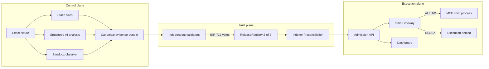

# MCPShield MVP Architecture

## Scope

The MVP admits exact local stdio MCP releases. It does not create another registry, token, DAO, or universal remote attestation system.

## Release identity

A release is bound to all three values:

1. canonical `releaseId` such as `mail-mcp@1.0.0`;
2. `sha256:` artifact digest of exact reviewed bytes;
3. `0x` bytes32 hash of the canonical MCP tool surface.

Admission requires all three. Mutable names and valid publisher signatures are insufficient.

## State ownership

| Component | Owns |
|---|---|
| Scanner | findings, sandbox observations, evidence hash |
| API/SQLite | requests, scans, pending operations, query projection |
| Validators | independent EIP-712 signing keys and decisions |
| ReleaseRegistry | public release hashes, votes, terminal status |
| Indexer/Reconciler | deterministic projection recovery from chain truth |
| Gateway | final pre-spawn admission enforcement |
| Dashboard | read-only LIVE or explicitly labelled REPLAY presentation |

## Status machine

- New release: `UNVERIFIED`
- First `FAIL`: `QUARANTINED`
- Two `PASS` votes: `VERIFIED`
- Two `FAIL` votes: `REVOKED`
- `REVOKED` is terminal for that release ID.

Timeout, unavailable chain truth, an unknown response, and either hash mismatch all result in `BLOCK`.

## Trust boundaries

- Scanner submissions require a dedicated bearer token and are revalidated against shared JSON Schemas. The Backend stamps their source as `LIVE`.
- Validator private keys never enter the API. Signer recovery, validator membership, nonce, deadline, evidence binding, and one-vote-per-release are enforced across API and contract.
- Raw evidence stays off-chain. Only fixed-size hashes, votes, status, and events are placed on-chain.
- The Gateway creates its own immutable artifact snapshot, computes both hashes, checks admission, and starts only the manifest entrypoint with `shell: false`.
- Scanner and Gateway inspect the same bounded artifact bytes with a self-contained ESM policy: executable artifact code is `.mjs` only, using allowlisted non-network `node:` built-ins or relative `.mjs` modules inside the snapshot. Gateway execution also uses Node's filesystem permission boundary, disabled string code generation and runtime egress, and a minimal child environment.
- The stdio proxy admits the exact artifact before spawn, relays the MCP initialization lifecycle, inspects every JSON-RPC batch element, allows only manifest-declared `tools/call` names, and blocks duplicate or mismatched `tools/list` responses.
- API writes after an EVM receipt reconcile from chain truth, so an indexer that projects the same log first is idempotent. SQLite WAL uses a bounded busy timeout for the demo's two writers.
- Dashboard secrets and Backend tokens remain server-side.

## Runtime modes

- `LIVE`: calls the Backend and fails closed on invalid or unavailable status.
- `REPLAY`: consumes committed, explicitly labelled evidence for an offline presentation.
- `MOCK`: deterministic component tests only.
- `LOCAL_DEMO` ledger: Backend mirrors the contract state machine in SQLite.
- `EVM` ledger: Backend reads and writes a deployed `ReleaseRegistry` through an RPC deadline.

The default Compose demo deploys `ReleaseRegistry` to its local EVM, shares the resulting address and deployment block through a small env artifact, and starts both Backend and indexer against that deployment. Gateway A and B each run a LIVE malicious-release probe before serving health traffic; the Dashboard validates their probe evidence rather than labelling a direct Backend preview as Gateway enforcement. `npm run demo:evm-smoke` verifies the same deploy-to-index flow, including indexer-first receipt races, without Docker.
